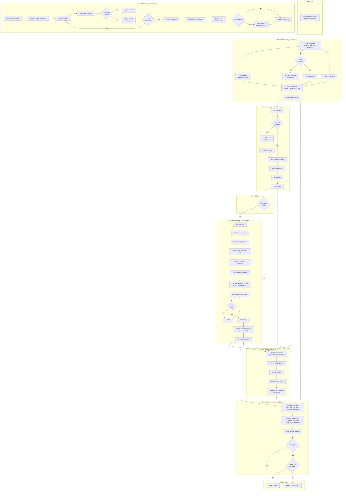

# Chunker Module - Low-Level Design

This document contains a comprehensive flow diagram illustrating the complete chunking pipeline with exact file and method references.

---

## Complete Chunking Pipeline



---

## Key Components Reference

### File: `formatter.py`
- **format_function_for_embedding()**: Creates three-layer format (header + docstring + code)
- **truncate_content()**: Intelligently truncates content while preserving semantic information

### File: `token_counter.py`
- **get_encoding()**: Loads and caches tiktoken encoding (cl100k_base)
- **count_tokens()**: Accurately counts tokens using OpenAI's tokenizer

### File: `hasher.py`
- **generate_chunk_id()**: Creates deterministic SHA-256 hash from content + metadata

### File: `models.py`
- **Chunk dataclass**: Core data structure with id, content, metadata, token_count, truncated
- **is_valid property**: Validates chunk has positive token count and non-empty content

### File: `chunker.py`
- **chunk_function()**: Main orchestrator for single function transformation
- **chunk_functions()**: Batch processor with graceful degradation and statistics

---

## Design Principles

### 1. Three-Layer Content Format
```python
# /path/to/file.py:70-73          <- Location (spatial context)
"""Returns location string"""       <- Docstring (semantic meaning)
@property                           <- Code (implementation)
def location(self) -> str:
    return f"{self.file_path}:{self.start_line}"
```

### 2. Intelligent Truncation Strategy
When content exceeds 8000 tokens:
1. Preserve header (location context)
2. Preserve docstring (semantic meaning)
3. Truncate code from end (implementation details less critical)
4. Mark as truncated for monitoring

### 3. Deterministic ID Generation
```python
hash_input = f"{file_path}:{start_line}:{content}"
chunk_id = hashlib.sha256(hash_input.encode('utf-8')).hexdigest()
```

**Properties:**
- Same content → same ID (deterministic)
- Different content → different ID (avalanche effect)
- Collision probability ≈ 0 (SHA-256)

### 4. Token Counting with Caching
- tiktoken encoding loaded once and cached
- Reduces overhead for batch processing (~100ms saved per chunk)
- Accurate subword tokenization matching OpenAI's API

### 5. Graceful Degradation
- Invalid chunks filtered out (don't crash pipeline)
- Warnings logged for debugging
- Statistics tracked for quality monitoring

---

## Incremental Update Strategy

When a file is modified:

```python
# Conceptual logic (implemented in storage/embedder modules)
old_ids = set(db.get_all_ids_for_file(file_path))
new_ids = set(chunk.id for chunk in new_chunks)

deleted = old_ids - new_ids  # In old but not new → remove from DB
new = new_ids - old_ids      # In new but not old → insert to DB
unchanged = new_ids & old_ids # In both → skip (cache hit)
```

**Efficiency:**
- Unchanged functions: Same ID → skip embedding (cache hit)
- Modified functions: Different ID → re-embed (content changed)
- Deleted functions: ID not in new set → remove from database
