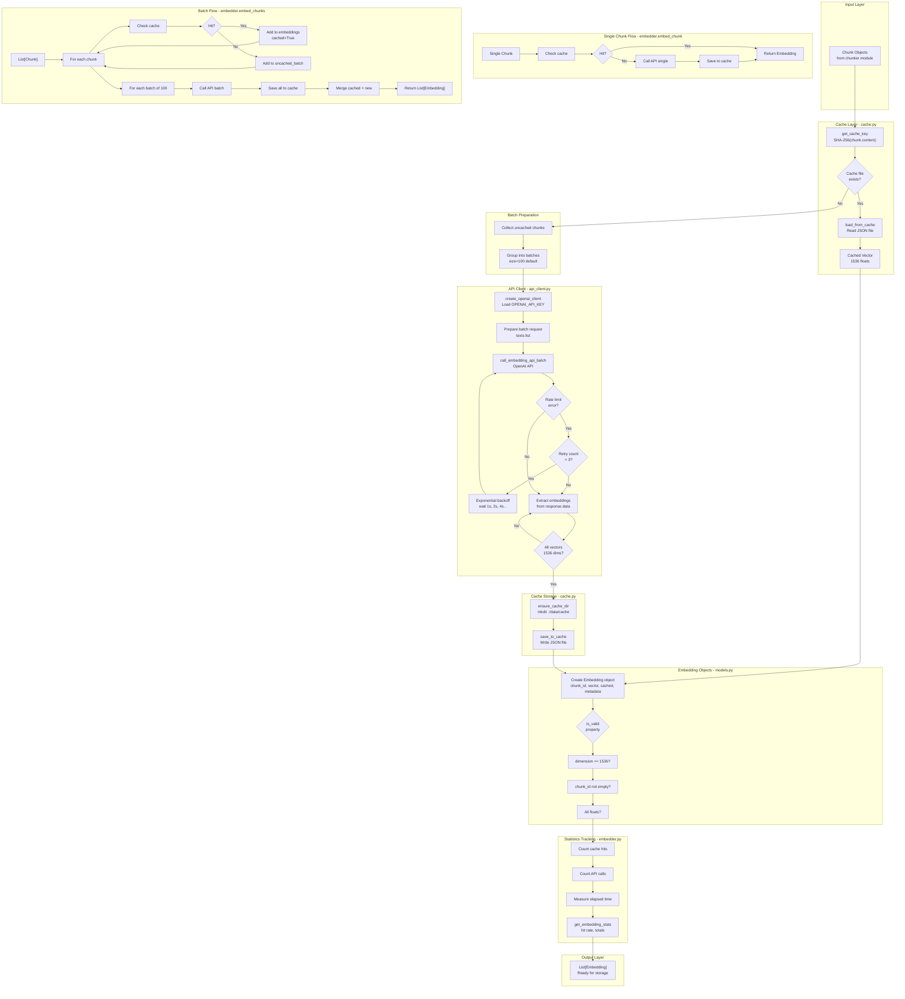

# Embedder Module - Low-Level Design

This document contains a comprehensive flow diagram illustrating the complete embedding pipeline with exact file and method references.

---

## Complete Embedding Pipeline



---

## Key Components Reference

### File: `models.py`
- **Embedding dataclass**: Core data structure with chunk_id, vector, cached flag, metadata
- **dimension property**: Returns len(vector), should be 1536
- **is_valid property**: Validates dimension, chunk_id, and vector types
- **as_numpy property**: Converts vector to numpy array for numerical operations
- **to_dict/from_dict**: Serialization for storage

### File: `cache.py`
- **get_cache_key()**: Generates SHA-256 hash from chunk content
- **ensure_cache_dir()**: Creates ./data/cache/ directory if not exists
- **load_from_cache()**: Checks for cache file and loads vector if exists
- **save_to_cache()**: Writes vector to JSON file with cache key as filename
- **get_cache_stats()**: Returns total entries, size in MB, cache directory path
- **clear_cache()**: Removes all cache files (for testing/reset)

### File: `api_client.py`
- **create_openai_client()**: Initializes OpenAI client with API key from env
- **call_embedding_api()**: Single embedding API call with retry logic
- **call_embedding_api_batch()**: Batch API call (up to 2048 inputs)
- **Exponential backoff**: Retry with 1s, 2s, 4s delays on rate limit
- **Dimension validation**: Ensures all vectors are 1536 dimensions

### File: `embedder.py`
- **embed_chunk()**: Cache-first single chunk embedding
- **embed_chunks()**: Batch processing with cache checks and statistics
- **get_embedding_stats()**: Returns cache hit rate, API calls, validation status

---

## Design Principles

### 1. Cache-First Strategy

**Always check cache before API:**
```python
1. Compute cache key: SHA-256(chunk.content)
2. Check if ./data/cache/{key}.json exists
3. If yes: Load and return (fast path: <1ms)
4. If no: Call API and save (slow path: 50-200ms)
```

**Benefits:**
- Avoid redundant API calls
- Save time (100x+ speedup on cache hit)
- Save money (API calls cost $0.00002 per 1K tokens)

### 2. Batch Processing Optimization

**Grouping strategy:**
```python
# Instead of 100 individual API calls:
for chunk in chunks:
    embed(chunk.content)  # 100 × 90ms overhead = 9s

# Group into 1 batch API call:
embed_batch([chunk.content for chunk in chunks])  # 1 × 90ms = 90ms
```

**Optimal batch size: 100-500 chunks**
- Too small: Don't get full benefit of batching
- Too large: Memory issues, all-or-nothing failure
- 100: Good balance for most use cases

### 3. Exponential Backoff for Rate Limits

**Retry strategy:**
```python
Attempt 1: Call API → RateLimitError
Wait: 1 second (2^0)
Attempt 2: Call API → RateLimitError
Wait: 2 seconds (2^1)
Attempt 3: Call API → Success
```

**Why exponential:**
- Gives API time to recover
- Avoids overwhelming the service
- Graceful degradation (max 3 retries)

### 4. Deterministic ID Generation

**Cache key formula:**
```python
cache_key = hashlib.sha256(chunk.content.encode('utf-8')).hexdigest()
# Result: 64-character hex string
```

**Properties:**
- **Deterministic**: Same content → same key
- **Avalanche effect**: 1 char change → completely different key
- **Collision-resistant**: Probability ≈ 0 (2^-256)

**Enables automatic cache invalidation:**
- Modified code → different content → different key
- Old cache entry naturally becomes unused
- No manual invalidation logic needed

### 5. Statistics Tracking

**Metrics collected:**
```python
{
    'total_embeddings': 100,
    'cached_count': 85,
    'api_count': 15,
    'cache_hit_rate': 85.0,  # percentage
    'avg_dimension': 1536,
    'all_valid': True
}
```

**Use cases:**
- Monitor cache effectiveness
- Debug API issues
- Optimize batch sizes
- Track costs

---

## Error Handling Strategy

### 1. Rate Limit Errors
```
RateLimitError → Exponential backoff → Retry (max 3x) → Fail gracefully
```

### 2. Network Errors
```
NetworkError → Log error → Return None → Continue with next chunk
```

### 3. Dimension Validation Errors
```
len(vector) != 1536 → Log error → Return None → Don't cache invalid result
```

### 4. Cache Errors
```
Cache read/write error → Log warning → Fall back to API → Continue processing
```

**Graceful Degradation:**
- Individual chunk failures don't crash entire batch
- Warnings logged for debugging
- Statistics track success/failure rates

---

## Cache File Structure

**Location:** `./data/cache/{sha256_hash}.json`

**Format:**
```json
{
  "vector": [0.0234, -0.0891, 0.1234, ..., -0.0456],
  "dimension": 1536
}
```

**⚠️ Design Choice: Local Disk Cache**

This implementation uses **local disk caching** - a **conscious choice for learning/development**:

**Why Local Disk:**
- Simple to understand and debug
- No external dependencies (Redis, databases)
- Easy to inspect cache files manually
- Perfect for single-machine development
- Aligns with learning objectives

**Limitations (Production):**
- ❌ Ephemeral (pods restart → cache lost)
- ❌ Not shared (multiple pods → duplicate caches)
- ❌ No durability (disk failure → cache lost)
- ❌ No replication or backup

**Production Alternatives:**

1. **Redis/Memcached** (Recommended for most cases)
   - Shared across all pods
   - Fast (~1ms latency)
   - Persistent with AOF/RDB
   - Built-in eviction policies

2. **PostgreSQL/MongoDB** (Database cache)
   - Persistent and queryable
   - ACID guarantees
   - Slower (~10-50ms)

3. **ChromaDB as Cache** (Best for RAG systems)
   - Single source of truth
   - Already in your architecture
   - No duplicate storage
   - Persistent and searchable

4. **S3/GCS + Local Cache** (Two-tier)
   - Infinite storage
   - Cheap and durable
   - Higher latency (~50-100ms)

**Recommended Production Architecture:**
```
Request → Redis (L1: 1ms) → ChromaDB (L2: 10ms) → OpenAI API (200ms)
```

**When to Upgrade:**
- Deploying to Kubernetes/containers
- Need horizontal scaling
- High availability requirements
- Cache durability is critical

---

## Performance Characteristics

### Single Chunk Embedding

**Cache hit:**
- Time: <1ms
- Cost: $0

**Cache miss:**
- Time: 50-200ms
- Cost: ~$0.00002 per 1K tokens

### Batch Embedding (100 chunks)

**All cached:**
- Time: ~10ms (100 × 0.1ms)
- Cost: $0

**All uncached:**
- Time: ~1 second (1 API call)
- Cost: ~$0.002

**Mixed (50% cached):**
- Time: ~500ms
- Cost: ~$0.001

---

## Integration with Pipeline

### Input from Chunker
```python
Chunk(
    id="7a3f9e2d...",
    content="# /path/to/file.py:42-43\n\n@property\ndef is_valid(self)...",
    metadata={...},
    token_count=61,
    truncated=False
)
```

### Output to Storage
```python
Embedding(
    chunk_id="7a3f9e2d...",
    vector=[0.0234, -0.0891, ..., -0.0456],  # 1536 floats
    cached=False,
    metadata={...}
)
```

### ChromaDB Insertion (Next Component)
```python
collection.add(
    ids=[embedding.chunk_id],
    embeddings=[embedding.vector],
    metadatas=[embedding.metadata]
)
```

---

## Summary

This diagram illustrates:

1. **Cache-First Strategy**: Always check cache before API call
2. **Batch Processing**: Group chunks for efficiency (100 per batch)
3. **Rate Limit Handling**: Exponential backoff with max 3 retries
4. **Deterministic Caching**: SHA-256 keys enable automatic invalidation
5. **Statistics Tracking**: Monitor cache hit rate and API usage
6. **Error Handling**: Graceful degradation on individual failures
7. **Dimension Validation**: Ensure all vectors are 1536 dimensions
8. **Integration Points**: Clean input from chunker, output to storage

All components reference actual file and method names for easy code navigation.
