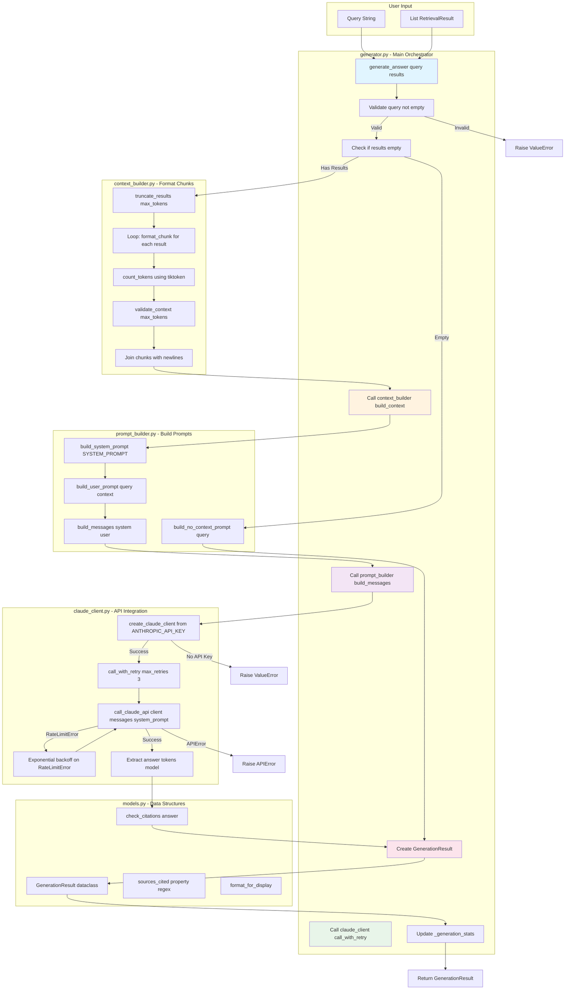
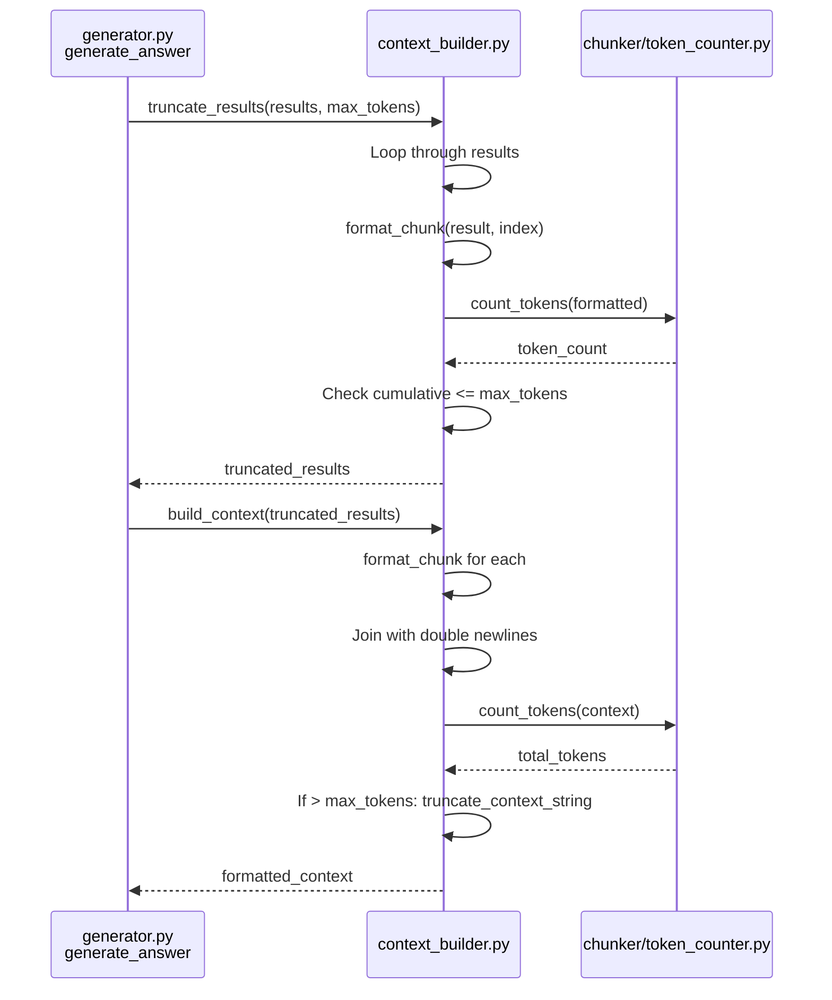
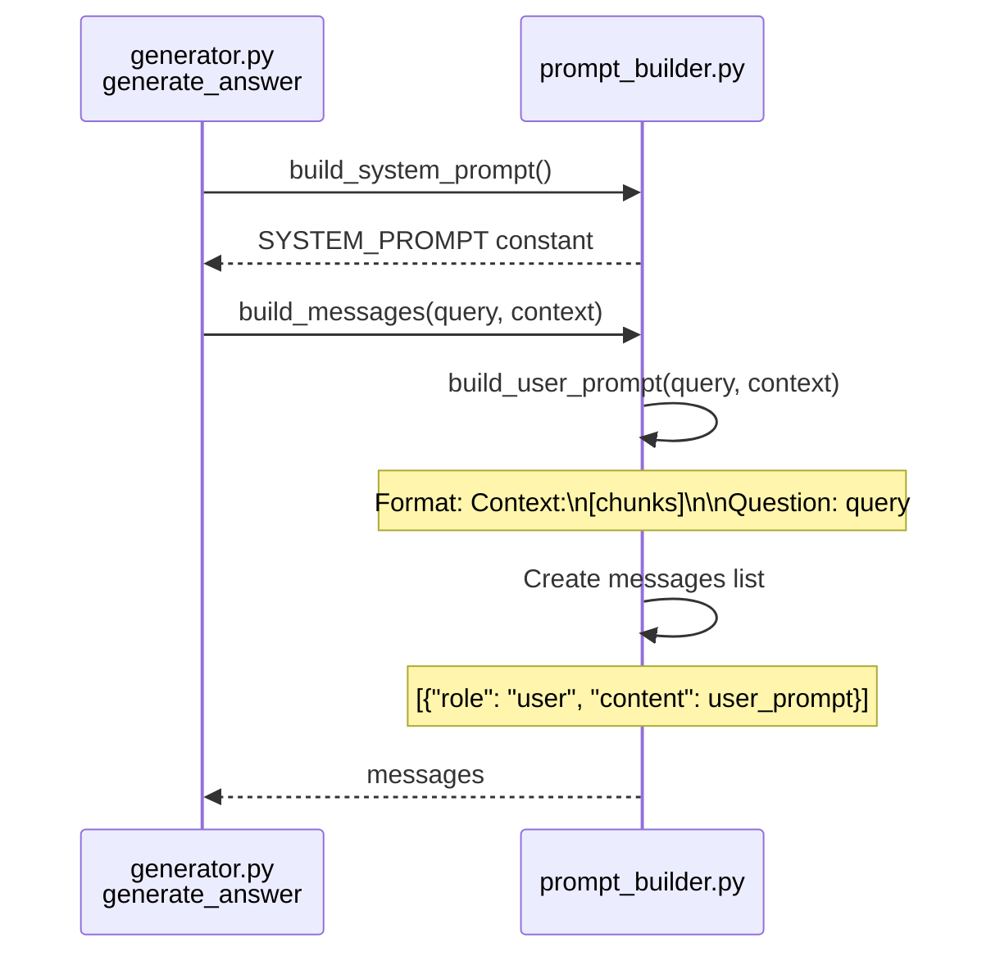
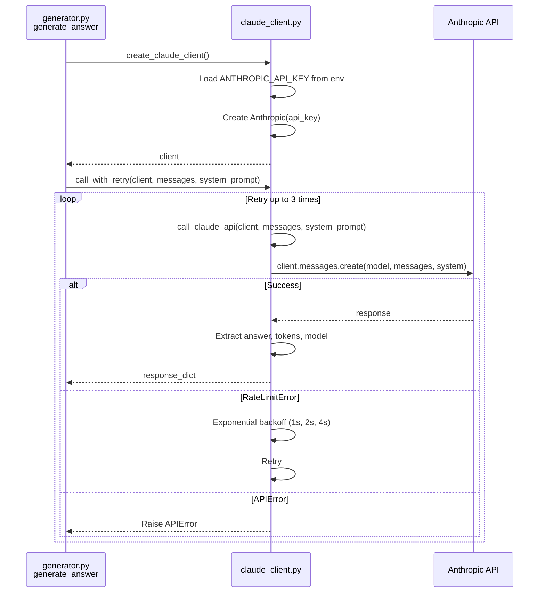
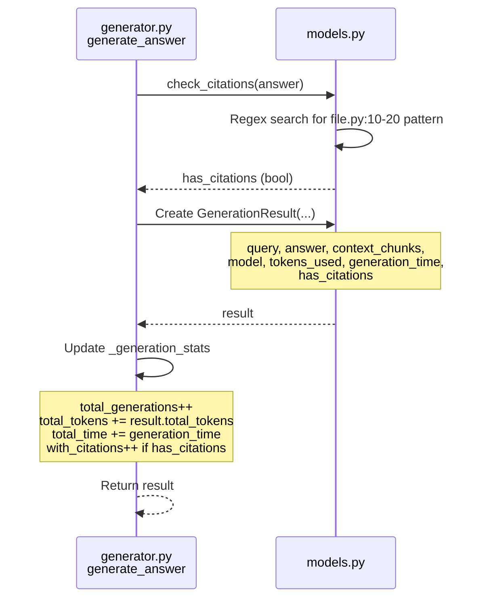
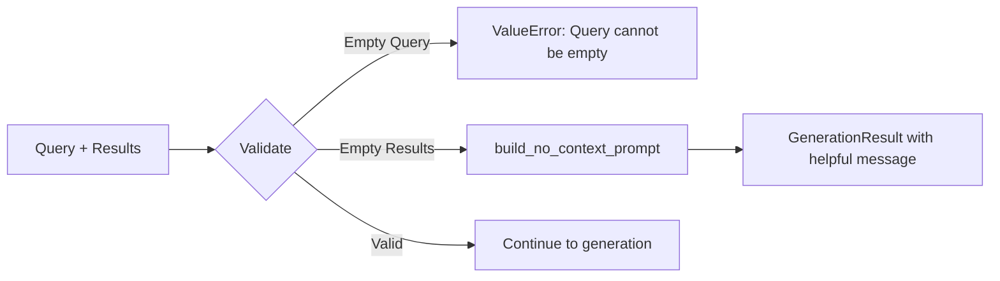
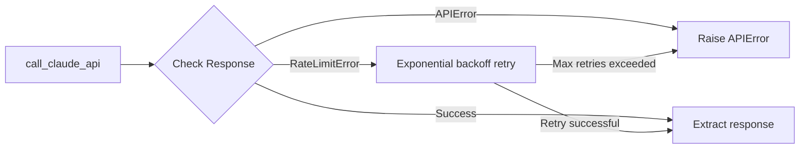
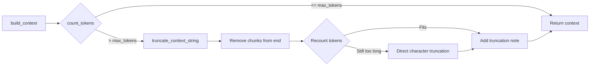

# Generator Module - Low-Level Design

This document provides a detailed low-level design of the Generator module with file/method references.

---

## Unified Data Flow Diagram



---

## Detailed Component Flows

### 1. Context Building Flow



**Key Methods:**
- `context_builder.truncate_results()` - Keeps chunks until token budget exceeded
- `context_builder.format_chunk()` - Creates `[1] file.py:10-20\n```python\ncode\n```\n` format
- `context_builder.build_context()` - Joins all formatted chunks
- `chunker.token_counter.count_tokens()` - Uses tiktoken for accurate counting

### 2. Prompt Building Flow



**Key Methods:**
- `prompt_builder.build_system_prompt()` - Returns `SYSTEM_PROMPT` constant
- `prompt_builder.build_user_prompt()` - Formats context + question
- `prompt_builder.build_messages()` - Creates message list for API

**System Prompt:**
```python
SYSTEM_PROMPT = """You are a code assistant...
IMPORTANT RULES:
1. Answer based ONLY on provided code
2. Always cite file and line numbers
3. Use format: function_name() (file.py:start-end)
..."""
```

### 3. Claude API Call Flow



**Key Methods:**
- `claude_client.create_claude_client()` - Loads API key from `.env`
- `claude_client.call_claude_api()` - Makes actual API call
- `claude_client.call_with_retry()` - Wraps with exponential backoff

**API Parameters:**
- `model`: `"claude-sonnet-4-20250514"`
- `max_tokens`: `2048` (for answer)
- `temperature`: `0.0` (deterministic)
- `system`: System prompt string
- `messages`: User message with context + question

### 4. Result Creation Flow



**Key Methods:**
- `models.check_citations()` - Regex to detect `file.py:10-20` patterns
- `models.GenerationResult.__init__()` - Creates result object
- `generator.generate_answer()` - Updates global stats

**GenerationResult Properties:**
- `sources_cited` - Extract all file:line citations
- `answer_length` - Word count
- `quality_score` - Heuristic based on citations and length
- `format_for_display()` - Pretty print for terminal

---

## Error Handling

### Input Validation



**Handled in:** `generator.py:generate_answer()`

### API Errors



**Handled in:** `claude_client.py:call_with_retry()`

### Token Budget Overflow



**Handled in:** `context_builder.py:build_context()` and `truncate_context_string()`

---

## Key Design Decisions

### 1. Separate Context and Prompt Building

**Files:** `context_builder.py` vs `prompt_builder.py`

**Rationale:**
- Single responsibility principle
- Context building handles token counting/truncation
- Prompt building handles message formatting
- Each testable in isolation

### 2. Facade Pattern in generator.py

**Method:** `generate_answer()` orchestrates all submodules

**Rationale:**
- Simple public API hides complexity
- Easy to use: `generate_answer(query, results)`
- Coordinates: context → prompt → API → result
- Centralized error handling and logging

### 3. Exponential Backoff for Rate Limits

**Method:** `claude_client.call_with_retry()`

**Rationale:**
- Rate limits are common with API usage
- Exponential backoff (1s, 2s, 4s) prevents hammering
- Only retries on RateLimitError, not other errors
- Max 3 retries to avoid infinite loops

### 4. Temperature = 0.0

**Parameter:** `temperature=0.0` in API call

**Rationale:**
- Deterministic responses (same input → same output)
- Factual, not creative (we want accuracy, not variety)
- Reproducible results for testing
- Consistent citations

### 5. Citation Detection via Regex

**Method:** `models.check_citations()` and `sources_cited` property

**Rationale:**
- Simple pattern: `file.py:10-20`
- Reliable detection without NLP
- Enables quality checking
- Fast and efficient

---

## Integration Points

### Retriever Module

**Import:** `from ..retriever.models import RetrievalResult`

**Usage:**
```python
results: List[RetrievalResult] = retrieve(query)
answer = generate_answer(query, results)
```

**Data Flow:**
- Retriever provides `RetrievalResult` objects
- Generator formats them as context
- Each result has: content, metadata, score

### Chunker Module (Indirect)

**Import:** `from ..chunker.token_counter import count_tokens`

**Usage:**
```python
token_count = count_tokens(context)
```

**Why:**
- Reuse same tokenizer (tiktoken) for consistency
- Accurate token counting for context budget
- No need to duplicate token counting logic

### CLI Module (Next)

**Export:** `from src.generator import generate_answer, generate_with_retrieval`

**Usage in CLI:**
```python
# CLI query command
results = retrieve(query, top_k=5)
answer = generate_answer(query, results)
print(answer.format_for_display())
```

---

## File/Method Reference

### generator.py
- `generate_answer(query, results, max_context_tokens, max_answer_tokens)` - Main entry point
- `generate_with_retrieval(query, top_k, min_score)` - Complete RAG pipeline
- `get_generation_stats()` - Return statistics
- `reset_generation_stats()` - Clear statistics
- `_generation_stats` - Global stats dict

### context_builder.py
- `format_chunk(result, index)` - Format single chunk with [N] file:line
- `build_context(results, max_tokens)` - Format all chunks, check tokens
- `count_context_tokens(context)` - Count tokens in context
- `truncate_context_string(context, max_tokens)` - Truncate to fit
- `truncate_results(results, max_tokens)` - Truncate at chunk level
- `validate_context(context, max_tokens)` - Check if valid
- `get_context_stats(context)` - Statistics about context

### prompt_builder.py
- `SYSTEM_PROMPT` - Constant with instructions for Claude
- `build_system_prompt()` - Return system prompt
- `build_user_prompt(query, context)` - Format context + question
- `build_messages(query, context)` - Create messages list
- `build_no_context_prompt(query)` - Handle empty results
- `validate_prompt(query, context)` - Check inputs
- `format_prompt_for_display(messages, system_prompt)` - Pretty print

### claude_client.py
- `create_claude_client()` - Initialize from ANTHROPIC_API_KEY
- `call_claude_api(client, messages, system_prompt, model, max_tokens, temperature)` - Make API call
- `call_with_retry(client, messages, system_prompt, max_retries)` - Retry with backoff
- `validate_response(response)` - Check response validity
- `estimate_cost(tokens, model)` - Calculate API cost
- `get_client_stats()` - Client configuration info

### models.py
- `GenerationResult` - Dataclass for results
  - Properties: `sources_cited`, `answer_length`, `quality_score`, etc.
  - Methods: `to_dict()`, `format_for_display()`
- `check_citations(answer)` - Detect citations in answer
- `extract_code_blocks(answer)` - Find code blocks
- `format_generation_stats(results)` - Statistics for multiple results

---

## Performance Considerations

### Token Counting
- **Cost:** O(n) where n = context length
- **Frequency:** Once per context build, once per truncation check
- **Optimization:** Cache tokenizer (`get_encoding()` in token_counter)

### Context Truncation
- **Strategy:** Remove chunks from end until fits
- **Alternative:** Could re-rank chunks, but adds complexity
- **Trade-off:** Simple and fast vs optimal selection

### API Calls
- **Latency:** ~2-5 seconds per call
- **Bottleneck:** Network + Claude processing
- **Mitigation:** Retry logic, but no caching (answers are query-specific)

### Memory Usage
- **Context:** ~6000 tokens × 4 bytes/char = ~24KB
- **Results:** 5-10 chunks × ~1KB = ~10KB
- **Total:** Minimal (<1MB per generation)

---

## Testing Strategy

### Unit Tests (per file)
- `context_builder.py`: Test formatting, token counting, truncation
- `prompt_builder.py`: Test prompt construction, validation
- `claude_client.py`: Test client creation, retry logic (mock API)
- `models.py`: Test properties, citation extraction

### Integration Tests
- `generator.py`: Test complete flow with mock API
- End-to-end: Test with real retrieval results

### Manual Tests
- `test_generator_manual.py`: Real API calls with various scenarios
- Verify citations, token limits, error handling

---

This LLD provides a complete technical reference for the Generator module implementation.
