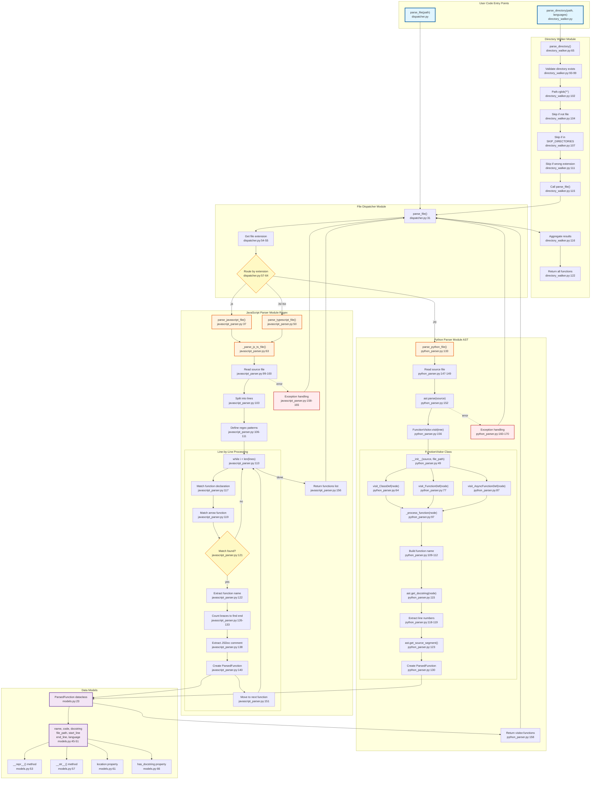
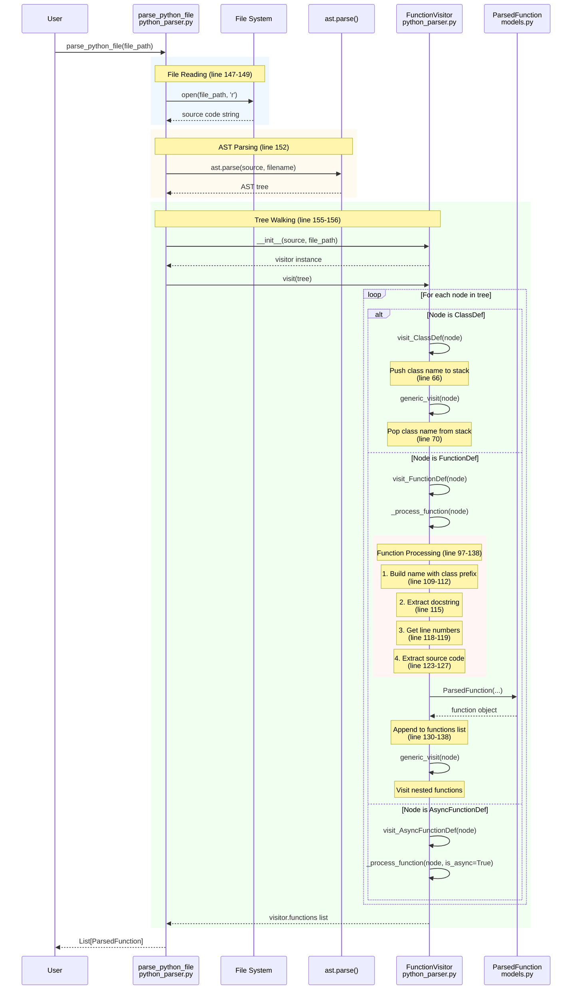
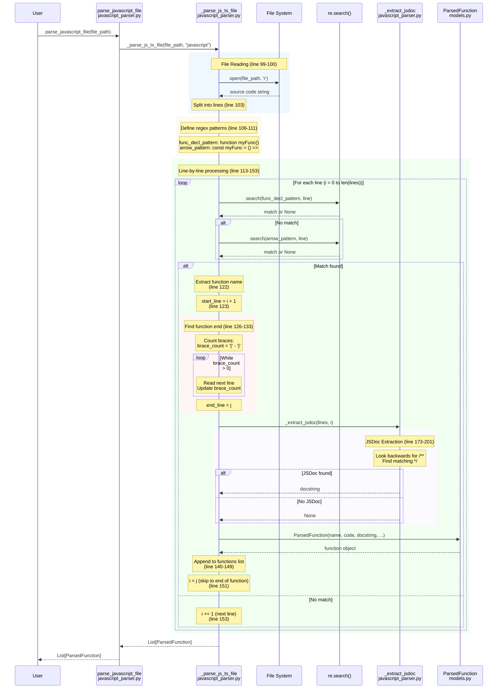
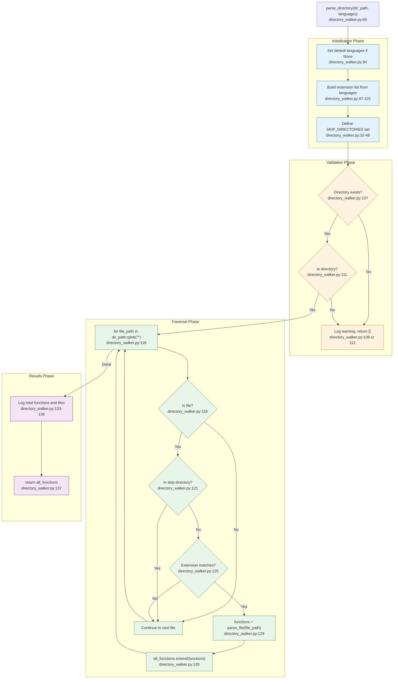
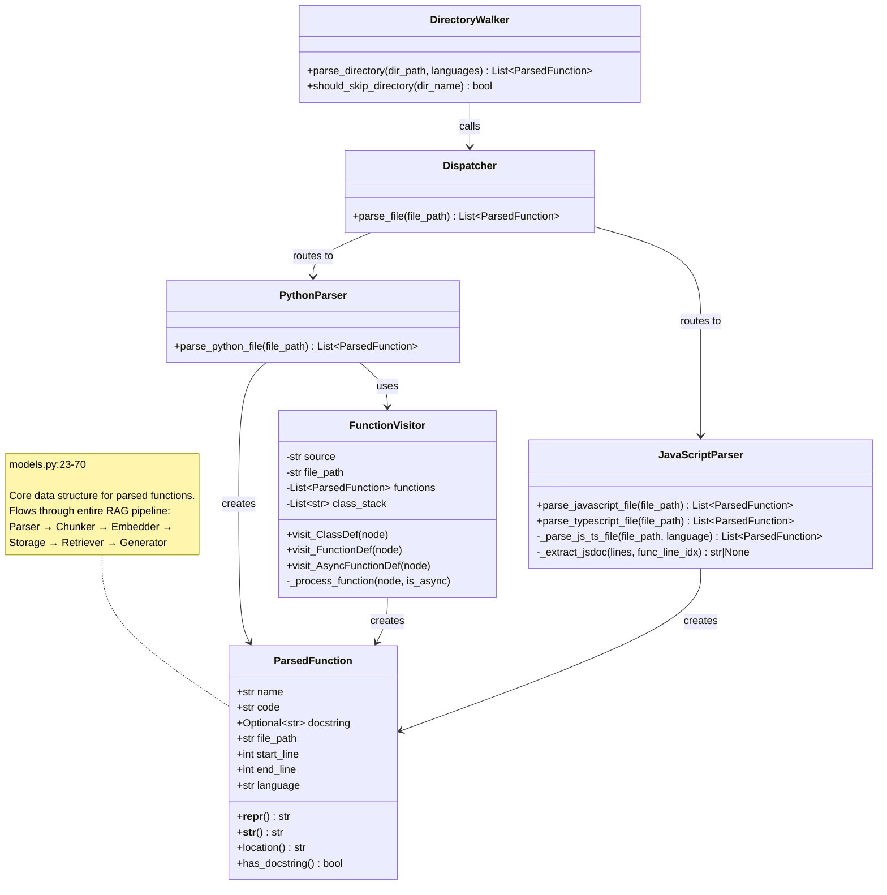
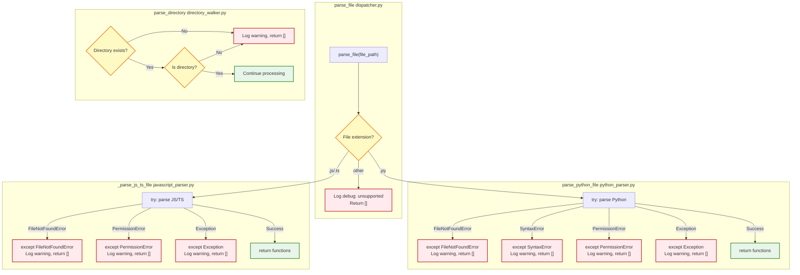

# Parser Module - Low-Level Design (LLD)

**Purpose**: Detailed technical diagram showing data flow, function calls, and implementation details

---

## Complete System Flow

This diagram shows the complete flow from user code to parsed functions, with file and method references for every component.

---

## Python Parser Detailed Flow

This diagram focuses on the Python AST parsing implementation.

---

## JavaScript Parser Detailed Flow

This diagram focuses on the regex-based JavaScript/TypeScript parsing.

---

## Directory Walker Detailed Flow

This diagram shows how directory traversal and filtering works.

---

## Data Model Structure

This diagram shows the ParsedFunction dataclass and its properties.

---

## Error Handling Flow

This diagram shows how errors are handled gracefully throughout the module.

---

## Key Design Patterns

### 1. Visitor Pattern (Python Parser)

**File**: `python_parser.py`
**Classes**: `FunctionVisitor` extends `ast.NodeVisitor`

The Visitor pattern allows us to walk the AST tree and process specific node types without modifying the AST structure.

### 2. Strategy Pattern (Dispatcher)

**File**: `dispatcher.py`
**Function**: `parse_file()`

The Strategy pattern selects the appropriate parsing algorithm (Python AST vs JS/TS regex) based on file extension.

### 3. Template Method Pattern (Error Handling)

**Files**: All parser files
**Pattern**: `try-except-return-empty-list`

Each parser follows the same error handling template: try to parse, catch specific exceptions, log warnings, return empty list.

### 4. Builder Pattern (ParsedFunction Creation)

**File**: `models.py`
**Class**: `ParsedFunction` (dataclass)

The dataclass provides a clean builder-like interface for creating function objects with all required metadata.

---

## Performance Characteristics

### Time Complexity

| Operation | Complexity | Notes |
|-----------|------------|-------|
| `parse_file()` | O(n) | n = file size in lines |
| `parse_directory()` | O(m × n) | m = files, n = avg file size |
| AST parsing | O(n) | Linear in source size |
| Regex parsing | O(n²) | Worst case with nested braces |
| Directory traversal | O(m) | m = total files in tree |

### Space Complexity

| Structure | Complexity | Notes |
|-----------|------------|-------|
| ParsedFunction | O(k) | k = function code size |
| Functions list | O(f × k) | f = functions, k = avg size |
| AST tree | O(n) | n = source size |
| Visitor stack | O(d) | d = nesting depth |

### Bottlenecks

1. **File I/O**: Reading large files from disk
2. **Regex matching**: Nested loops in JS/TS parser
3. **Memory**: Storing full source code for each function

### Optimizations

1. **Caching**: Could cache parsed results by file hash
2. **Streaming**: Could process files in chunks
3. **Parallel**: Could parse multiple files concurrently
4. **Tree-sitter**: Could upgrade JS/TS to O(n) parsing

---

## Summary

This LLD provides:

1. **Complete data flow** from user code to parsed functions
2. **File and method references** for every component
3. **Sequence diagrams** showing interaction patterns
4. **Error handling flows** demonstrating graceful degradation
5. **Design patterns** used throughout the module
6. **Performance characteristics** and optimization opportunities

Use this diagram to:
- Understand how components interact
- Trace execution paths for debugging
- Identify where to make changes
- Learn design patterns in practice
- Optimize performance bottlenecks

---

**Last Updated**: January 2, 2026
**Diagrams**: 6 Mermaid diagrams with full file/method references
**Purpose**: Technical reference for parser module implementation
