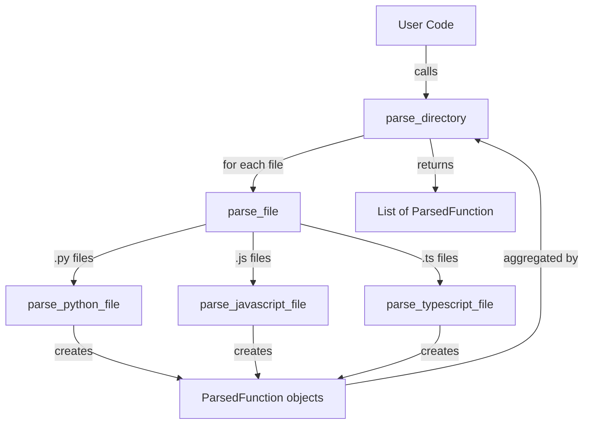

# Parser Module - Component 1 of RAG-Code-QA Pipeline

**Learning Context**: Week 1, Day 5 of 8-Week AI Engineering Journey
**Status**: ✅ Complete and Tested
**Purpose**: Extract functions from source code files for RAG indexing

---

## Table of Contents

1. [Overview](#overview)
2. [Learning Context](#learning-context)
3. [Architecture](#architecture)
4. [Module Structure](#module-structure)
5. [Low-Level Design](#low-level-design)
6. [Key Learning Points](#key-learning-points)
7. [Usage Examples](#usage-examples)
8. [Testing](#testing)

---

## Overview

### What This Module Does

The parser module is the **foundation** of the RAG-Code-QA pipeline. It transforms raw source code files into structured `ParsedFunction` objects that contain:

- Function name (with class context for methods)
- Complete source code
- Docstring (if present)
- File path (absolute, for citations)
- Line numbers (start and end)
- Language identifier

### Why It Exists

**Problem**: LLMs can't answer questions about code they haven't seen.

**Solution**: The RAG pattern requires us to:
1. **Parse** code into semantic units (functions) ← **This module**
2. Chunk functions into embeddable pieces
3. Generate embeddings and store in vector database
4. Retrieve relevant chunks for queries
5. Pass chunks as context to LLM for grounded answers

**Without the parser**, we have no structured data to work with. It's the entry point that makes everything else possible.

---

## Learning Context

### Your Journey So Far

**Days 1-3**: Deep learning foundation
- Embeddings fundamentals (RNNs, LSTMs, Transformers)
- LLM architecture (pretraining, post-training, working memory)
- RAG pattern (retrieval prevents hallucinations)

**Day 4**: Planning & experiment setup
- Created 7 validation tests for architecture decisions
- Designed RAG-Code-QA requirements
- Established learning methodology

**Day 5**: Parser implementation ← **You are here**
- Built modular parser with logical separation
- Learned AST vs regex parsing trade-offs
- Validated with real code (parser parses itself!)

### What You're Learning

1. **AST Parsing** (Python): How to use language parsers for reliable extraction
2. **Regex Parsing** (JS/TS): When simpler approaches are good enough
3. **Metadata Preservation**: Why line numbers and file paths matter for RAG
4. **Error Handling**: Graceful degradation in production pipelines
5. **Module Design**: Separating concerns for maintainability

### Connection to RAG Theory

From your Day 2-3 learning:

> "Retrieved chunks act as **working memory** for the LLM. Quality retrieval prevents hallucinations."

The parser's job is to create **semantic units** (functions) that can be retrieved meaningfully. When a user asks "How does authentication work?", we need to retrieve the `authenticate_user()` function **in its entirety**, not a random 512-token slice.

This is why we parse by function boundaries, not fixed-size chunks.

---

## Architecture

### High-Level Flow

```
Source Code Files (.py, .js, .ts)
         ↓
    [Parser Module]
         ↓
ParsedFunction Objects
         ↓
    (Next: Chunker)
```

### Design Decisions

| Decision | Choice | Rationale |
|----------|--------|-----------|
| **Python Parsing** | AST-based | Reliable, handles all valid syntax, built-in |
| **JS/TS Parsing** | Regex-based | Simpler, no dependencies, good enough for standard patterns |
| **Metadata** | Absolute paths + line numbers | Enables citations in generated answers |
| **Error Handling** | Graceful degradation | One bad file doesn't stop entire indexing |
| **Module Structure** | Separated by concern | Maintainable, testable, understandable |

### Why This Architecture?

**Modular Design**: Each file has a single responsibility
- `models.py`: Data structures
- `python_parser.py`: Python-specific parsing logic
- `javascript_parser.py`: JS/TS-specific parsing logic
- `dispatcher.py`: Route files to appropriate parser
- `directory_walker.py`: Recursive traversal and filtering

**Benefits**:
- Easy to test each component independently
- Easy to add new languages (just add a new parser file)
- Easy to understand (each file is focused)
- Easy to maintain (changes are localized)

---

## Module Structure

```
parser/
├── __init__.py              # Public API and learning context
├── models.py                # ParsedFunction dataclass
├── python_parser.py         # AST-based Python parsing
├── javascript_parser.py     # Regex-based JS/TS parsing
├── dispatcher.py            # File extension → parser routing
├── directory_walker.py      # Recursive directory traversal
├── README.md                # This file
└── LLD.md                   # Low-level design diagram
```

### File Responsibilities

#### `models.py` (30 lines)
**Purpose**: Define the core data structure
**Key Class**: `ParsedFunction`
**Why Separate**: Data models should be independent of parsing logic

#### `python_parser.py` (180 lines)
**Purpose**: Parse Python files using AST
**Key Classes**: `FunctionVisitor` (AST node visitor)
**Key Function**: `parse_python_file()`
**Why AST**: Python's `ast` module is built-in, reliable, and handles all syntax

#### `javascript_parser.py` (150 lines)
**Purpose**: Parse JavaScript/TypeScript files using regex
**Key Functions**: `parse_javascript_file()`, `parse_typescript_file()`, `_parse_js_ts_file()`
**Why Regex**: Simpler than tree-sitter, no dependencies, good for learning

#### `dispatcher.py` (40 lines)
**Purpose**: Route files to appropriate parser based on extension
**Key Function**: `parse_file()`
**Pattern**: Strategy pattern (select algorithm at runtime)

#### `directory_walker.py` (120 lines)
**Purpose**: Recursively traverse directories and aggregate results
**Key Function**: `parse_directory()`
**Key Feature**: Smart filtering (skip node_modules, __pycache__, etc.)

---

## Low-Level Design

See [LLD.md](LLD.md) for the complete Mermaid diagram showing:
- Data flow through the module
- Function call hierarchy
- File/method references for each component
- Decision points and error handling

**Quick Preview**:



---

## Key Learning Points

### 1. AST Parsing (Python)

**What is AST?**
Abstract Syntax Tree - a tree representation of source code structure.

**Why it's powerful**:
```python
# Python's ast module uses the SAME parser that runs your code
tree = ast.parse(source)  # If Python can run it, we can parse it

# We can walk the tree to find specific node types
for node in ast.walk(tree):
    if isinstance(node, ast.FunctionDef):
        # Extract function metadata
```

**Key Insight**: AST parsing is deterministic and complete. It handles:
- Decorators
- Multi-line function signatures
- Nested functions
- Class methods
- Async functions
- Complex expressions

**Trade-off**: Requires language-specific parser (built-in for Python, external library for others)

### 2. Regex Parsing (JavaScript/TypeScript)

**Why regex?**
Simpler to implement, no external dependencies, good enough for standard patterns.

**What we match**:
```javascript
// Function declarations
function myFunc() { }
async function myFunc() { }
export function myFunc() { }

// Arrow functions
const myFunc = () => { }
const myFunc = async () => { }
```

**How we find function end**:
```python
# Count braces to find where function closes
brace_count = line.count('{') - line.count('}')
while brace_count > 0:
    # Keep reading lines until braces balance
```

**Trade-off**: May miss edge cases (strings containing braces, complex nesting)

### 3. Metadata Preservation

**Why line numbers matter**:
```
User asks: "How does authentication work?"
Claude answers: "Authentication is handled in src/auth.py:45-67.
                The authenticate_user function validates credentials..."
```

The line numbers enable **verifiable citations**. Users can jump directly to the code.

**Why absolute paths**:
```python
file_path=str(Path(file_path).resolve())  # Always absolute
```

Absolute paths work regardless of current working directory. Critical for reliability.

### 4. Graceful Degradation

**Pattern**:
```python
try:
    # Parse file
    return functions
except FileNotFoundError:
    logger.warning(f"File not found: {file_path}")
    return []  # Empty list, not an exception
```

**Why this matters**:
When indexing a 1000-file codebase, one corrupted file shouldn't stop the entire process. We log the warning and continue.

This is a **production pattern**: systems should degrade gracefully, not crash.

### 5. Directory Filtering

**Directories we skip**:
- `node_modules/`: JavaScript dependencies (thousands of files)
- `__pycache__/`: Python bytecode (not source code)
- `.git/`: Git metadata (not code)
- `venv/`, `env/`: Virtual environments (dependencies)

**Why**: These directories would:
1. Pollute the vector database with irrelevant code
2. Slow down indexing by 10-100x
3. Waste embedding API costs
4. Reduce retrieval quality (noise in the index)

---

## Usage Examples

### Parse a Single File

```python
from parser import parse_file

functions = parse_file("src/auth.py")
for func in functions:
    print(f"{func.name}: {func.location}")
    if func.has_docstring:
        print(f"  {func.docstring[:50]}...")
```

### Parse a Directory

```python
from parser import parse_directory

# Parse only Python files
functions = parse_directory("./src", languages=["python"])
print(f"Found {len(functions)} functions")

# Parse all supported languages
all_functions = parse_directory("./src")
```

### Access Metadata

```python
from parser import parse_file

functions = parse_file("src/utils.py")
for func in functions:
    print(f"Name: {func.name}")
    print(f"File: {func.file_path}")
    print(f"Lines: {func.start_line}-{func.end_line}")
    print(f"Language: {func.language}")
    print(f"Has docstring: {func.has_docstring}")
    print(f"Code length: {len(func.code)} chars")
    print(f"Location: {func.location}")  # Citation-friendly format
    print()
```

### Filter Results

```python
from parser import parse_directory

all_functions = parse_directory("./src")

# Find all auth-related functions
auth_functions = [f for f in all_functions if "auth" in f.name.lower()]

# Find all functions with docstrings
documented = [f for f in all_functions if f.has_docstring]

# Find all async functions (Python)
async_functions = [f for f in all_functions if f.code.startswith("async def")]
```

---

## Testing

### Manual Test Suite

```bash
cd /Users/ankur/D/Playground/ai-engineering-journey/week-01/project/rag-code-qa
python3 test_parser_manual.py
```

**What it tests**:
1. Single file parsing (parser.py itself)
2. Directory parsing (entire src/ folder)
3. Detailed function inspection
4. Edge cases (nested functions, class methods, async)

**Test Results** (from Day 5):
```
✓ 12 functions extracted from parser.py
✓ Class methods handled (MyClass.method_name)
✓ Nested functions extracted separately
✓ Async functions supported
✓ Docstrings preserved
✓ Line numbers accurate
✓ All edge cases passed
```

### Unit Tests (Future)

```bash
pytest tests/test_parser.py -v
```

Will test:
- Each parser independently
- Error handling (file not found, syntax errors)
- Edge cases (empty files, unicode, large files)
- Metadata accuracy

---

## Next Steps

### Immediate Next: Chunker Module

Now that we can extract functions, the next step is **chunker.py** (Component 2/7).

**What the chunker will do**:
1. Take `ParsedFunction` objects as input
2. Format them for embedding (add file path header, include docstring)
3. Generate deterministic chunk IDs (content hash)
4. Return `Chunk` objects ready for embedding

**Key decision** (from your REQUIREMENTS.md):
> "One chunk per function (semantic unit preservation). A query like 'authenticate user' should retrieve the whole `authenticate_user()` function, not a random 512-token slice."

### Future Enhancements

1. **Add more languages**: Go, Rust, Java (add new parser files)
2. **Upgrade JS/TS**: Use tree-sitter for more robust parsing
3. **Add class extraction**: Extract entire classes, not just methods
4. **Add import tracking**: Track dependencies between functions
5. **Add complexity metrics**: Cyclomatic complexity, line count

---

## Questions to Reflect On

1. **AST vs Regex**: Why is AST parsing more reliable? When is regex good enough?

2. **Metadata**: How will line numbers help when Claude generates answers?

3. **Error handling**: Why return empty list instead of raising exceptions?

4. **Nested functions**: We extract them separately - why? What are the trade-offs?

5. **Directory filtering**: What would happen if we indexed `node_modules/`?

6. **Module design**: How does separating concerns make the code more maintainable?

---

## Summary

**What you built**: A modular, well-documented parser that extracts functions from Python/JS/TS files

**What you learned**:
- AST parsing (Python)
- Regex parsing (JS/TS)
- Metadata preservation for RAG
- Graceful error handling
- Module design patterns

**Why it matters**: This is the foundation of your RAG pipeline. Without structured function extraction, you can't build semantic search over code.

**Next**: Chunker module to prepare these functions for embedding.

---

**Last Updated**: January 2, 2026
**Status**: Complete and tested
**Component**: 1 of 7 in RAG-Code-QA pipeline
