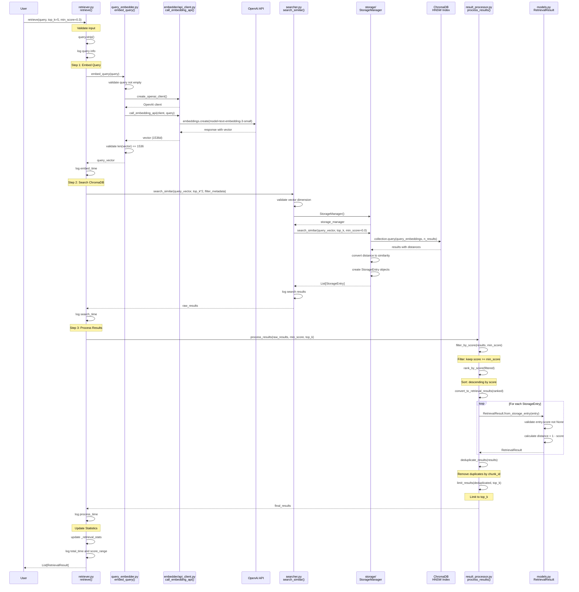
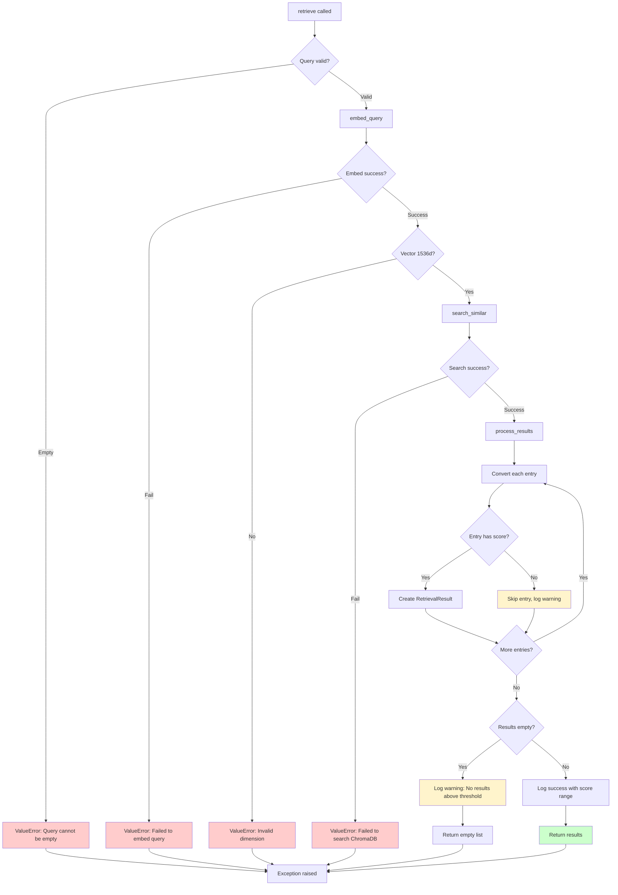
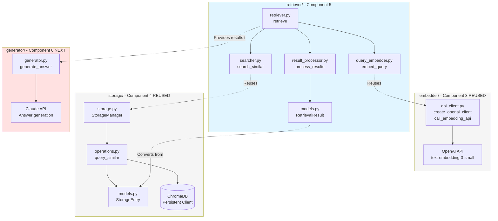

# Retriever Module - Low-Level Design

## Overview

This document provides detailed low-level design diagrams for the Retriever module, showing the complete data flow from query to results with file/method references.

---

## Unified Architecture Diagram

This diagram shows the complete retrieval flow with all components, data structures, and integration points.

```mermaid
graph TB
    subgraph UserInterface [User Interface]
        Query[User Query String]
    end

    subgraph RetrieverModule [retriever.py - Main Orchestrator]
        RetrieveFunc[retrieve query top_k min_score filter_metadata]
        ValidateInput[Validate Input]
        EmbedStep[Step 1: Embed Query]
        SearchStep[Step 2: Search ChromaDB]
        ProcessStep[Step 3: Process Results]
        LogStats[Log Statistics]
        ReturnResults[Return RetrievalResult List]
    end

    subgraph QueryEmbedderModule [query_embedder.py]
        EmbedQuery[embed_query query]
        ValidateQuery[Validate Query]
        CreateClient[create_openai_client]
        CallAPI[call_embedding_api client query]
        ValidateVector[Validate Vector 1536d]
        ReturnVector[Return Query Vector]
    end

    subgraph EmbedderIntegration [embedder/api_client.py - Reused]
        OpenAIClient[OpenAI Client]
        EmbedAPI[Embedding API Call]
        APIResponse[API Response]
    end

    subgraph SearcherModule [searcher.py]
        SearchSimilar[search_similar query_vector top_k filter_metadata]
        ValidateVector2[Validate Vector]
        CreateStorage[Create StorageManager]
        CallStorage[storage_manager.search_similar]
        LogSearch[Log Search Results]
        ReturnStorage[Return StorageEntry List]
    end

    subgraph StorageIntegration [storage/ - Reused]
        StorageManager[StorageManager]
        QuerySimilar[operations.query_similar]
        ChromaDB[(ChromaDB HNSW Index)]
        RawResults[Raw Results with Distances]
    end

    subgraph ResultProcessorModule [result_processor.py]
        ProcessResults[process_results storage_entries min_score top_k]
        FilterScore[filter_by_score results min_score]
        RankScore[rank_by_score results]
        ConvertResults[convert_to_retrieval_results entries]
        Deduplicate[deduplicate_results results]
        LimitResults[limit_results results top_k]
        ReturnFinal[Return Final Results]
    end

    subgraph ModelsModule [models.py]
        StorageEntry[StorageEntry from storage]
        RetrievalResult[RetrievalResult]
        FromStorageEntry[from_storage_entry entry]
        Properties[Properties: location function_name is_relevant relevance_category]
    end

    Query --> RetrieveFunc
    RetrieveFunc --> ValidateInput
    ValidateInput --> EmbedStep

    EmbedStep --> EmbedQuery
    EmbedQuery --> ValidateQuery
    ValidateQuery --> CreateClient
    CreateClient --> OpenAIClient
    OpenAIClient --> CallAPI
    CallAPI --> EmbedAPI
    EmbedAPI --> APIResponse
    APIResponse --> ValidateVector
    ValidateVector --> ReturnVector
    ReturnVector --> SearchStep

    SearchStep --> SearchSimilar
    SearchSimilar --> ValidateVector2
    ValidateVector2 --> CreateStorage
    CreateStorage --> StorageManager
    StorageManager --> CallStorage
    CallStorage --> QuerySimilar
    QuerySimilar --> ChromaDB
    ChromaDB --> RawResults
    RawResults --> LogSearch
    LogSearch --> ReturnStorage
    ReturnStorage --> ProcessStep

    ProcessStep --> ProcessResults
    ProcessResults --> FilterScore
    FilterScore --> RankScore
    RankScore --> ConvertResults
    ConvertResults --> FromStorageEntry
    FromStorageEntry --> RetrievalResult
    RetrievalResult --> Deduplicate
    Deduplicate --> LimitResults
    LimitResults --> ReturnFinal
    ReturnFinal --> LogStats
    LogStats --> ReturnResults
    ReturnResults --> UserInterface

    style RetrieverModule fill:#e1f5ff
    style QueryEmbedderModule fill:#fff4e1
    style SearcherModule fill:#f0e1ff
    style ResultProcessorModule fill:#e1ffe1
    style ModelsModule fill:#ffe1e1
    style EmbedderIntegration fill:#f5f5f5
    style StorageIntegration fill:#f5f5f5
```



---

## Detailed Sequence Diagram

This diagram shows the exact method calls and data flow through the retrieval pipeline.



---

## Data Structure Transformations

This diagram shows how data structures transform through the pipeline.

```mermaid
graph LR
    subgraph Input
        QueryString[Query String<br/>How does auth work?]
    end

    subgraph QueryEmbedding [query_embedder.py]
        QueryVector[Query Vector<br/>List float 1536d<br/>0.023 -0.145 ...]
    end

    subgraph Search [searcher.py + storage/]
        ChromaResults[ChromaDB Results<br/>ids documents<br/>metadatas distances<br/>embeddings]
        StorageEntries[List StorageEntry<br/>id content embedding<br/>metadata score]
    end

    subgraph Processing [result_processor.py]
        Filtered[Filtered Entries<br/>score >= min_score]
        Ranked[Ranked Entries<br/>sorted by score desc]
        Converted[List RetrievalResult<br/>chunk_id content<br/>metadata score distance]
        Deduplicated[Deduplicated<br/>unique chunk_ids]
        Limited[Limited Results<br/>top_k entries]
    end

    subgraph Output
        FinalResults[List RetrievalResult<br/>with properties:<br/>location function_name<br/>is_relevant relevance_category]
    end

    QueryString --> QueryVector
    QueryVector --> ChromaResults
    ChromaResults --> StorageEntries
    StorageEntries --> Filtered
    Filtered --> Ranked
    Ranked --> Converted
    Converted --> Deduplicated
    Deduplicated --> Limited
    Limited --> FinalResults
```



---

## Error Handling Flow

This diagram shows error handling paths throughout the retrieval pipeline.



---

## Module Integration Map

This diagram shows how the retriever integrates with other modules.



---

## File and Method Reference Table

| File | Key Methods | Purpose | Dependencies |
|------|-------------|---------|--------------|
| `retriever.py` | `retrieve(query, top_k, min_score, filter_metadata)` | Main orchestrator | query_embedder, searcher, result_processor |
| | `retrieve_by_language(query, language, top_k, min_score)` | Language-filtered search | retrieve() |
| | `retrieve_from_file(query, file_path, top_k, min_score)` | File-filtered search | retrieve() |
| | `get_retrieval_stats()` | Statistics | Global _retrieval_stats |
| `query_embedder.py` | `embed_query(query, client)` | Embed query string | embedder.api_client |
| | `embed_queries_batch(queries, client)` | Batch embedding | embed_query() |
| | `validate_query_embedding(vector)` | Validation | None |
| `searcher.py` | `search_similar(query_vector, top_k, filter_metadata, storage_manager)` | ChromaDB search | storage.StorageManager |
| | `search_by_language(query_vector, language, top_k)` | Language search | search_similar() |
| | `search_by_file(query_vector, file_path, top_k)` | File search | search_similar() |
| | `get_search_stats(results)` | Search statistics | None |
| `result_processor.py` | `filter_by_score(results, min_score)` | Score filtering | None |
| | `rank_by_score(results)` | Score ranking | None |
| | `convert_to_retrieval_results(entries)` | Type conversion | models.RetrievalResult |
| | `deduplicate_results(results)` | Deduplication | None |
| | `limit_results(results, top_k)` | Result limiting | None |
| | `process_results(storage_entries, min_score, top_k)` | Complete pipeline | All above |
| | `get_result_statistics(results)` | Result statistics | None |
| `models.py` | `RetrievalResult` (dataclass) | Result data structure | storage.models.StorageEntry |
| | `from_storage_entry(entry)` | Conversion method | None |
| | `format_results_for_display(results)` | Display formatting | None |

---

## Performance Characteristics

### Time Complexity

| Operation | Complexity | Notes |
|-----------|------------|-------|
| Query embedding | O(1) | Fixed API call time (~200-400ms) |
| ChromaDB search | O(log n) | HNSW approximate nearest neighbor |
| Score filtering | O(k) | k = number of results |
| Score ranking | O(k log k) | Python sort |
| Deduplication | O(k) | Set-based |
| Total | O(log n + k log k) | Dominated by embedding API call |

### Space Complexity

| Component | Space | Notes |
|-----------|-------|-------|
| Query vector | O(1) | 1536 floats = ~6KB |
| Raw results | O(k) | k StorageEntry objects |
| Processed results | O(k) | k RetrievalResult objects |
| Total | O(k) | Linear in number of results |

### Typical Performance

- **Total query time:** 0.5-1.0 seconds
  - Embedding: 0.2-0.4s (OpenAI API)
  - Search: 0.05-0.1s (ChromaDB HNSW)
  - Processing: 0.01-0.05s (Python)
- **Throughput:** ~1-2 queries/second (single-threaded)
- **Scalability:** Linear with collection size (HNSW index)

---

## Key Design Decisions

### 1. Facade Pattern (retriever.py)

**Decision:** Single `retrieve()` function hides complexity

**Benefits:**
- Simple public API
- Easy to test
- Flexible implementation changes

**Implementation:**
```python
def retrieve(query, top_k, min_score, filter_metadata):
    query_vector = embed_query(query)
    raw_results = search_similar(query_vector, top_k * 2, filter_metadata)
    results = process_results(raw_results, min_score, top_k)
    return results
```

### 2. Module Reuse

**Decision:** Reuse embedder.api_client and storage.StorageManager

**Benefits:**
- DRY principle
- Consistency (same model)
- Reduced maintenance

**Implementation:**
```python
# query_embedder.py
from ..embedder.api_client import create_openai_client, call_embedding_api

# searcher.py
from ..storage import StorageManager
```

### 3. Over-fetching Strategy

**Decision:** Request `top_k * 2` from ChromaDB, filter to `top_k`

**Benefits:**
- Ensures enough results after filtering
- Handles edge cases (many low scores)

**Trade-off:** Slightly more processing, but negligible

### 4. Separation of Concerns

**Decision:** Separate files for embedding, searching, processing

**Benefits:**
- Testable in isolation
- Clear responsibilities
- Easier debugging

**Structure:**
- query_embedder.py: Embedding only
- searcher.py: Search only
- result_processor.py: Processing only

### 5. Score Threshold Default (0.3)

**Decision:** Default `min_score=0.3` based on validation

**Rationale:**
- Filters clear noise (<0.3)
- Keeps potentially relevant (0.3-0.5)
- Validated in Experiment 1, Test 7

---

## Testing Strategy

### Unit Tests (per file)

- `query_embedder.py`: Test embedding, validation, batch
- `searcher.py`: Test search, filtering, stats
- `result_processor.py`: Test filter, rank, convert, dedupe
- `models.py`: Test dataclass, properties, conversion

### Integration Tests

- End-to-end retrieval flow
- Module integration (embedder, storage)
- Error handling paths

### Manual Tests

See `test_retriever_manual.py` for 6 validation scenarios:
1. Basic retrieval
2. Score filtering
3. Metadata filtering
4. Empty results
5. Top-k limiting
6. Score ranking

---

## Future Enhancements

1. **Query caching** - Cache embeddings for common queries
2. **Result caching** - Cache results for identical queries
3. **Async API calls** - Non-blocking embedding
4. **Query expansion** - Generate multiple query variations
5. **Hybrid search** - Combine semantic + keyword search
6. **Re-ranking** - Use cross-encoder for better ranking
7. **Query analysis** - Suggest query improvements
8. **A/B testing** - Compare different retrieval strategies
