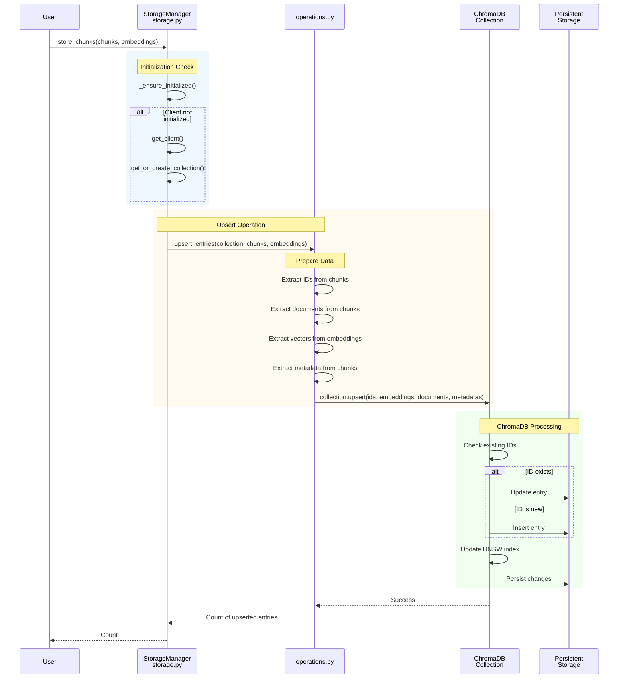
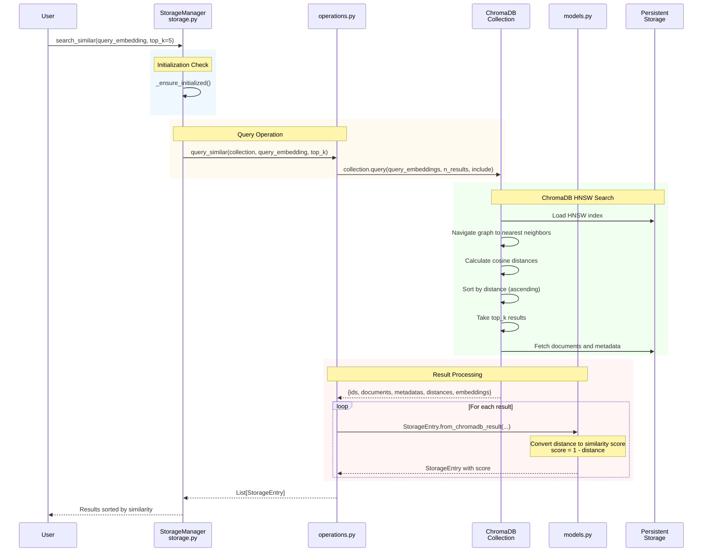
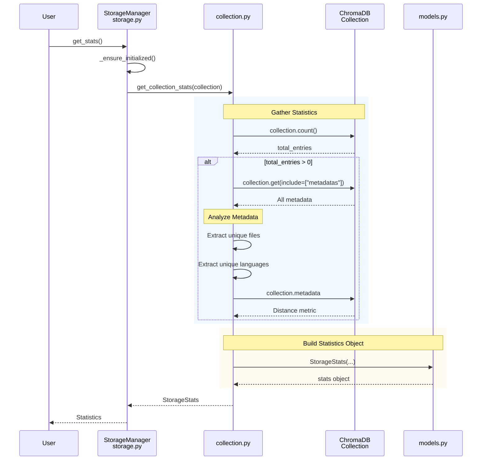
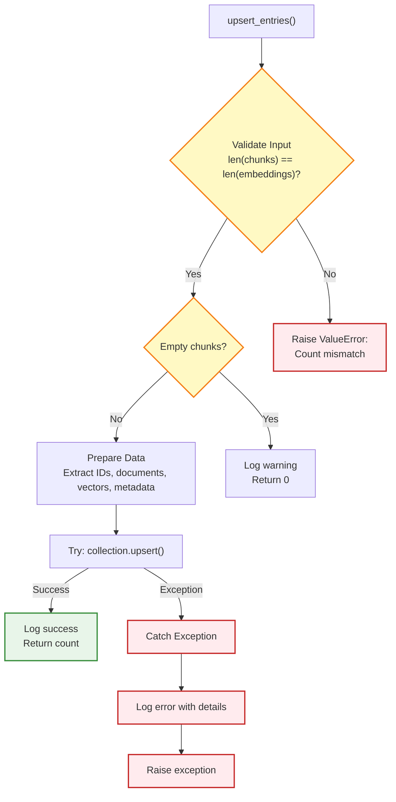
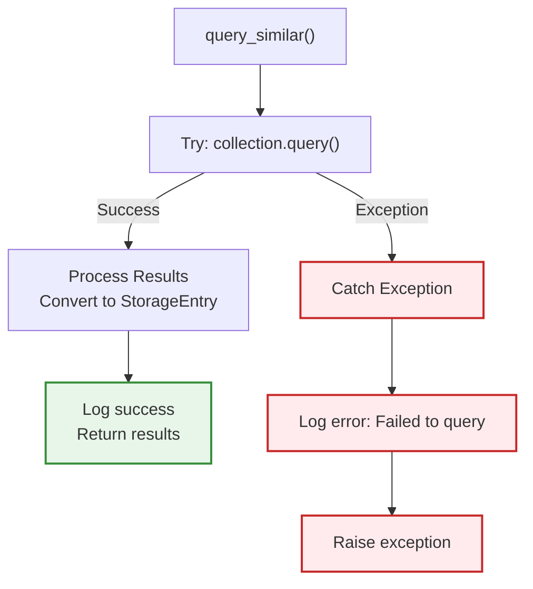

# Storage Module - Low-Level Design (LLD)

**Purpose**: Detailed technical diagram showing data flow, function calls, and implementation details for the storage module.

---

## Complete System Flow

This unified diagram shows the complete flow from user code to ChromaDB storage, with file and method references for every component.

```mermaid
graph TB
    subgraph UserCode [User Code Entry Points]
        API1["StorageManager()<br/>storage.py"]
        API2["store_chunks()<br/>storage.py:97"]
        API3["search_similar()<br/>storage.py:127"]
        API4["get_stats()<br/>storage.py:165"]
    end

    subgraph StorageManagerClass [StorageManager Facade - storage.py]
        SM_Init["__init__()<br/>storage.py:63"]
        SM_Ensure["_ensure_initialized()<br/>storage.py:86"]
        SM_Store["store_chunks()<br/>storage.py:97"]
        SM_Search["search_similar()<br/>storage.py:127"]
        SM_GetByID["get_by_id()<br/>storage.py:153"]
        SM_Stats["get_stats()<br/>storage.py:165"]
        SM_List["list_entries()<br/>storage.py:178"]
        SM_Count["count()<br/>storage.py:194"]
        SM_Clear["clear_collection()<br/>storage.py:206"]
    end

    subgraph ClientModule [Client Management - client.py]
        CL_Create["create_chromadb_client()<br/>client.py:23"]
        CL_Get["get_client()<br/>client.py:74"]
        CL_Singleton["_client_instance<br/>client.py:18"]
        CL_Settings["Settings()<br/>client.py:51"]
        CL_Persist["PersistentClient()<br/>client.py:48"]
    end

    subgraph CollectionModule [Collection Management - collection.py]
        CO_GetOrCreate["get_or_create_collection()<br/>collection.py:32"]
        CO_Delete["delete_collection()<br/>collection.py:79"]
        CO_Exists["collection_exists()<br/>collection.py:113"]
        CO_Stats["get_collection_stats()<br/>collection.py:132"]
        CO_ListAll["list_all_collections()<br/>collection.py:214"]
    end

    subgraph OperationsModule [CRUD Operations - operations.py]
        OP_Add["add_entries()<br/>operations.py:32"]
        OP_Upsert["upsert_entries()<br/>operations.py:78"]
        OP_Query["query_similar()<br/>operations.py:124"]
        OP_GetByID["get_by_id()<br/>operations.py:187"]
        OP_List["list_all()<br/>operations.py:221"]
        OP_Count["count_entries()<br/>operations.py:266"]
        OP_Delete["delete_by_ids()<br/>operations.py:282"]
    end

    subgraph ModelsModule [Data Models - models.py]
        M_Entry["StorageEntry<br/>models.py:31"]
        M_Stats["StorageStats<br/>models.py:127"]
        M_FromChroma["from_chromadb_result()<br/>models.py:82"]
        M_ToDict["to_dict()<br/>models.py:75"]
    end

    subgraph ChromaDBLayer [ChromaDB Embedded Database]
        CH_Client["PersistentClient"]
        CH_Collection["Collection"]
        CH_Add["collection.add()"]
        CH_Upsert["collection.upsert()"]
        CH_Query["collection.query()"]
        CH_Get["collection.get()"]
        CH_Count["collection.count()"]
        CH_Delete["collection.delete()"]
    end

    subgraph PersistenceLayer [Persistent Storage]
        Disk["./data/indexed/<br/>chroma.sqlite3<br/>vector files"]
    end

    subgraph InputData [Input from Previous Modules]
        InputChunks["Chunk objects<br/>from chunker"]
        InputEmbeddings["Embedding objects<br/>from embedder"]
    end

    subgraph OutputData [Output to Next Module]
        OutputEntries["StorageEntry objects<br/>for retriever"]
    end

    %% User API Flow
    API1 --> SM_Init
    API2 --> SM_Store
    API3 --> SM_Search
    API4 --> SM_Stats

    %% StorageManager Initialization
    SM_Init --> SM_Ensure
    SM_Ensure --> CL_Get
    SM_Ensure --> CO_GetOrCreate

    %% Client Initialization
    CL_Get --> CL_Singleton
    CL_Singleton -->|null| CL_Create
    CL_Create --> CL_Settings
    CL_Settings --> CL_Persist
    CL_Persist --> CH_Client
    CH_Client --> Disk

    %% Collection Management
    CO_GetOrCreate --> CH_Client
    CH_Client --> CH_Collection

    %% Store Flow
    SM_Store --> OP_Upsert
    InputChunks --> OP_Upsert
    InputEmbeddings --> OP_Upsert
    OP_Upsert --> CH_Upsert
    CH_Upsert --> Disk

    %% Search Flow
    SM_Search --> OP_Query
    OP_Query --> CH_Query
    CH_Query --> Disk
    CH_Query --> M_FromChroma
    M_FromChroma --> M_Entry
    M_Entry --> OutputEntries

    %% Stats Flow
    SM_Stats --> CO_Stats
    CO_Stats --> CH_Get
    CO_Stats --> CH_Count
    CH_Get --> M_Stats

    %% List Flow
    SM_List --> OP_List
    OP_List --> CH_Get

    %% Count Flow
    SM_Count --> OP_Count
    OP_Count --> CH_Count

    %% Clear Flow
    SM_Clear --> CO_Delete
    CO_Delete --> CH_Client

    %% Get by ID Flow
    SM_GetByID --> OP_GetByID
    OP_GetByID --> CH_Get

    classDef entryPoint fill:#e1f5ff,stroke:#01579b,stroke-width:3px
    classDef facade fill:#fff3e0,stroke:#e65100,stroke-width:2px
    classDef module fill:#e8f5e9,stroke:#388e3c,stroke-width:2px
    classDef model fill:#f3e5f5,stroke:#4a148c,stroke-width:2px
    classDef chromadb fill:#fff9c4,stroke:#f57f17,stroke-width:2px
    classDef storage fill:#ffebee,stroke:#c62828,stroke-width:2px
    classDef data fill:#e0f2f1,stroke:#00695c,stroke-width:2px

    class API1,API2,API3,API4 entryPoint
    class SM_Init,SM_Ensure,SM_Store,SM_Search,SM_Stats facade
    class CL_Create,CL_Get,CO_GetOrCreate,OP_Upsert,OP_Query module
    class M_Entry,M_Stats,M_FromChroma model
    class CH_Client,CH_Collection,CH_Upsert,CH_Query chromadb
    class Disk storage
    class InputChunks,InputEmbeddings,OutputEntries data
```

---

## Detailed Operation Flows

### 1. Store Operation (Upsert)

### 2. Search Operation (Query Similar)

### 3. Collection Statistics

---

## Error Handling Flows

### Upsert Error Handling

### Query Error Handling

---

## Key Design Patterns

### 1. Facade Pattern (StorageManager)

**File**: `storage.py`
**Class**: `StorageManager`

The Facade pattern provides a simple interface over the complex subsystem of client management, collection operations, and CRUD operations.

**Benefits**:
- Users don't need to understand ChromaDB internals
- Single entry point for all storage operations
- Encapsulates initialization complexity

### 2. Singleton Pattern (Client)

**File**: `client.py`
**Variable**: `_client_instance`

The Singleton pattern ensures only one ChromaDB client exists per process.

**Benefits**:
- Reuses connection (avoids overhead)
- Consistent state across module
- Efficient resource usage

### 3. Separation of Concerns

Each file has a single responsibility:
- `client.py`: Connection management
- `collection.py`: Collection lifecycle
- `operations.py`: CRUD operations
- `storage.py`: Orchestration

**Benefits**:
- Testability (can mock each layer)
- Maintainability (changes isolated)
- Clarity (each file has clear purpose)

---

## Performance Characteristics

### Time Complexity

| Operation | Complexity | Notes |
|-----------|------------|-------|
| `upsert_entries()` | O(n × log m) | n = new entries, m = existing entries (HNSW insert) |
| `query_similar()` | O(log m) | HNSW approximate nearest neighbor |
| `get_by_id()` | O(1) | Hash table lookup |
| `list_all()` | O(n) | n = entries to fetch |
| `get_collection_stats()` | O(m) | m = total entries (fetches all metadata) |

### Space Complexity

| Structure | Complexity | Notes |
|-----------|------------|-------|
| Embeddings | O(n × d) | n = entries, d = 1536 dimensions |
| HNSW index | O(n × log n) | Graph structure |
| Metadata | O(n × k) | k = avg metadata size |
| Documents | O(n × l) | l = avg document length |

### Bottlenecks

1. **HNSW index updates**: O(log n) per insert (acceptable for < 1M vectors)
2. **Metadata analysis**: `get_collection_stats()` fetches all entries (expensive for large collections)
3. **Disk I/O**: Persistent storage writes (mitigated by ChromaDB's batching)

### Optimizations

1. **Batch operations**: Upsert multiple entries at once (already implemented)
2. **Lazy initialization**: Client and collection created on first use
3. **Singleton client**: Reuse connection across operations
4. **HNSW indexing**: Fast approximate search (vs brute-force)

---

## Summary

This LLD provides:

1. **Complete data flow** from user code to persistent storage
2. **File and method references** for every component
3. **Sequence diagrams** showing interaction patterns
4. **Error handling flows** demonstrating graceful degradation
5. **Design patterns** used throughout the module
6. **Performance characteristics** and optimization opportunities

Use this diagram to:
- Understand how components interact
- Trace execution paths for debugging
- Identify where to make changes
- Learn design patterns in practice
- Optimize performance bottlenecks

---

**Last Updated**: January 3, 2026
**Diagrams**: 6 Mermaid diagrams with full file/method references
**Purpose**: Technical reference for storage module implementation
